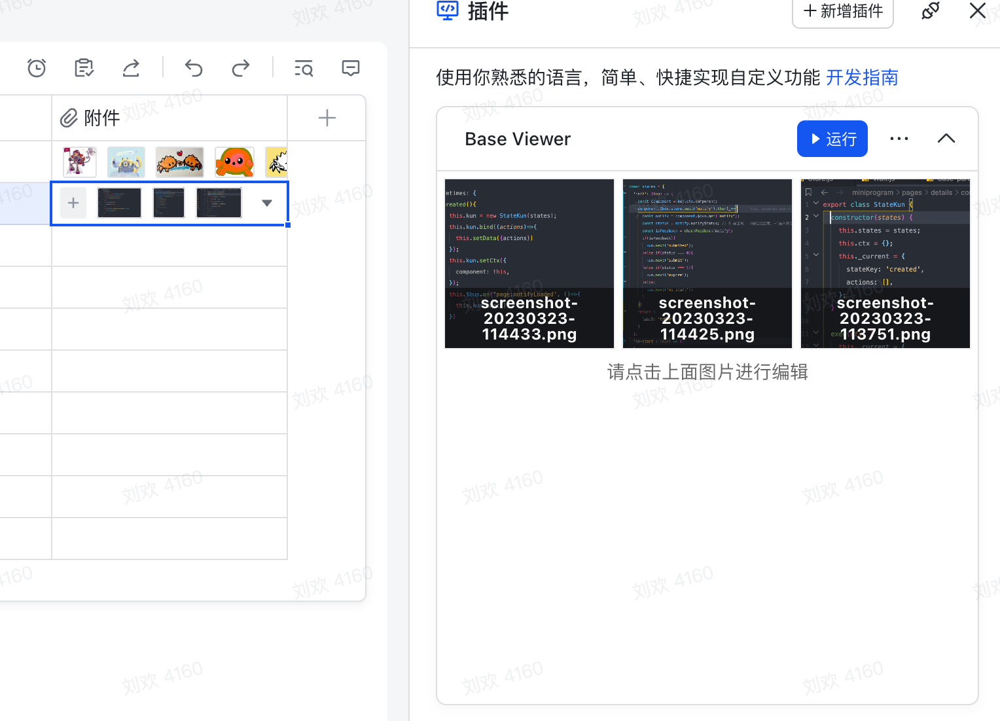
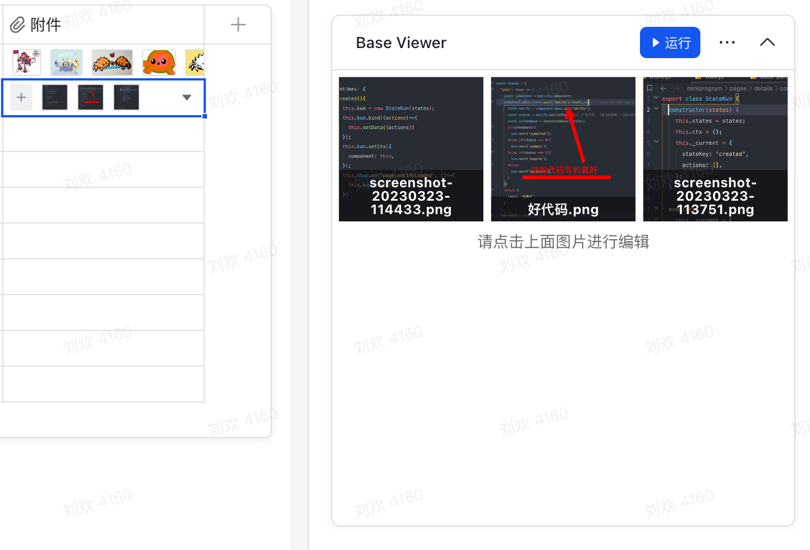

## Base Viewer

> 一个可以编辑图片的多维表格插件。






### Feature

- 图片编辑
- 图片裁剪
- 图片标记
- 图片颜色调整
- 重命名图片

### Getting Started

1️⃣ clone deme

```
git clone https://github.com/WumaCoder/bs-viewer
pnpm install
pnpm dev
```

2️⃣ 复制 http://localhost:3000/ 到 多维表格 webview 地址
